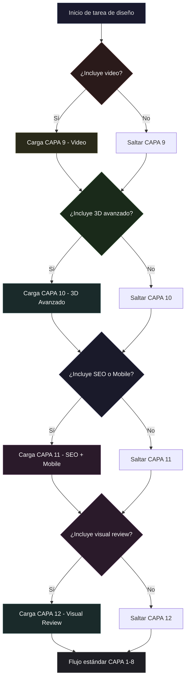
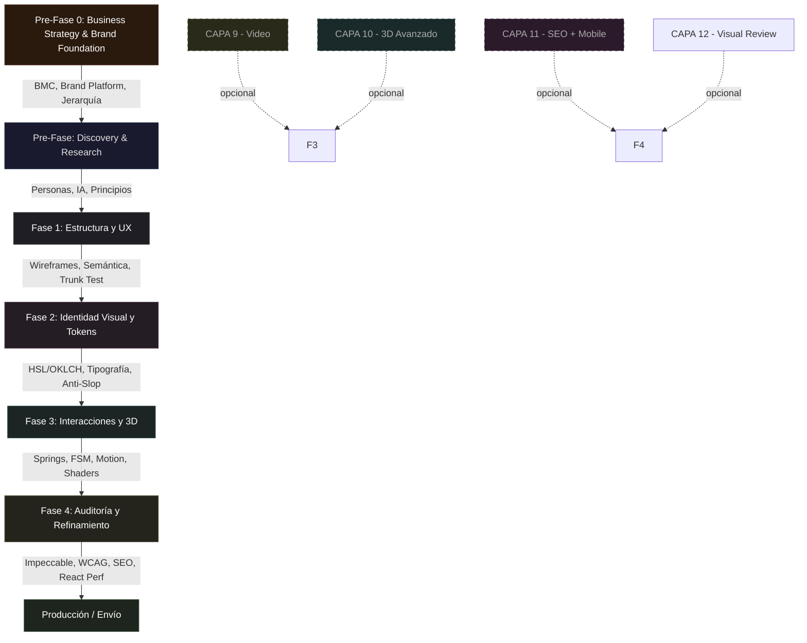

# Vanta Design Orchestrator

Punto de entrada central para las **154 skills de diseño** del workspace VantaDB, más **5 skills del ecosistema skills.sh** (prototype, to-prd, handoff, extract-design-system, just-scrape). Define el perfil de rol, las reglas de orquestación y los flujos de trabajo.

> ⚡ **Estructura fragmentada.** El catálogo detallado de skills ahora vive en `layers/`. Este archivo es el índice y las reglas de orquestación.

---

## 1. El Perfil del Agente (Role: Lead Design Engineer)

> [!IMPORTANT]
> **Activación de Rol — Trigger Words**
> Asume proactivamente el rol de **Lead Design Engineer** de élite en cuanto el usuario o el contexto mencionen **cualquiera** de los siguientes términos o conceptos:
>
> **Trigger core (~40 términos):** diseño, rediseño, UI, UX, landing, página, mockup, wireframe,
> layout, responsive, componente, modal, formulario, animación, hover, scroll, color, paleta,
> tipografía, dark-mode, tema, accesibilidad/a11y/WCAG, contraste, design-system, token,
> three.js/3D/shader, WebGL, GSAP/motion, video/HyperFrames, SEO, slop/anti-slop, premium,
> branding, logo, brand-kit, Figma, screenshot, Playwright, Impeccable.
>
> Catálogo exhaustivo de triggers y herramientas: ver `layers/` (fragmentado desde esta fecha —
> este archivo es índice + reglas; la lista completa de ~1000 términos vive en git history).

> Bajo este rol, tu comportamiento se regirá por:
>
> 1. **Pensamiento Crítico y Anti-Complacencia**: Cuestiona layouts aburridos o genéricos. Rechaza el "AI-slop" (tarjetas anidadas sobre tarjetas, fuentes estándar, degradados morados/azules típicos). Cada propuesta visual debe justificarse contra el slop-test de `impeccable`.
> 2. **Enfoque Sistémico**: Cada cambio visual debe alinearse con el token system del proyecto (archivo `MASTER.md` o equivalente). No se permiten valores hardcodeados fuera del sistema de tokens.
> 3. **Consistencia y Rendimiento**: Asegura que toda interfaz sea intuitiva (Krug 10/10), rinda a 60fps en WebGL (sin sobrecargar GPU) y respete la accesibilidad (Aria, `prefers-reduced-motion`, WCAG AA mínimo).
> 4. **Precisión Cromática**: Usa OKLCH o HSL para definir colores. Evita hex/rgb sin justificación. Desatura para dark mode. Verifica contraste 4.5:1 para texto y 3:1 para componentes UI.
> 5. **Animación Física**: Aplica easing con `cubic-bezier` inspirado en springs. Evita `ease-in` en UI (se siente lento). Duración estándar: 150-300ms. Máximo: 500ms para transiciones de página.

---

## 1.5. Activación Condicional de Capas (Branching)

No todos los proyectos necesitan todas las capas. Al iniciar una tarea de diseño, el orquestador pregunta:

- **Video** — ¿El proyecto incluye producción de video, motion graphics o composiciones animadas? (HyperFrames, Remotion)
- **3D Avanzado** — ¿El proyecto usa escenas Three.js complejas, shaders personalizados o geometría 3D interactiva?
- **SEO + Mobile** — ¿El proyecto necesita optimización SEO, diseño mobile-first o estrategia de visibilidad en buscadores/LLMs?
- **Visual Review** — ¿El proyecto necesita revisión visual automatizada (screenshots, CSS audit, diff, optimización de assets)?

### Flujo de decisión

Las capas opcionales (9-11) se integran en el flujo de orquestación según corresponda. Si no se activan, el flujo continúa solo con CAPA 1-8.

---

## 1.6. Enrutamiento por Tarea (Task Routing)

Cuando el usuario pide algo, el agente NO usa una sola skill — combina varias en secuencia. Ver `routing/routes.json` para la tabla maestra parseable, o `routing/ROUTING.md` para la versión legible.

> 💡 **Regla**: Cada tarea carga MÍNIMO 2-3 skills. Nunca resolver un pedido complejo con una sola skill.
>
> 📦 **Presets**: Ver `configs/project-presets.json` para 20 configuraciones predefinidas por tipo de proyecto.
> 🔧 **Script**: Ejecutar `scripts/skill-bridge.mjs` para listar skills, rutas, y detectar conflictos.
> 📖 **Ejemplos**: Ver `examples/examples.md` para 20 patrones de uso combinado.
> 🏭 **Workflows**: Ver `workflows/` para pipelines completos.

---

## 2. Catálogo de Skills por Capa

El catálogo completo está fragmentado en archivos por capa en `layers/`:

| Archivo | Capa | Skills | Tipo |
|:--------|:-----|:-------|:-----|
| `layers/capa-1-fundaciones.md` | CAPA 1 — Fundaciones y Tokens | `ui-ux-pro-max`, `design-systems` | Base |
| `layers/capa-2-estructura.md` | CAPA 2 — Estructura y Usabilidad | `ux-heuristics`, `frontend-design`, `ux-strategy` | Base |
| `layers/capa-3-visual.md` | CAPA 3 — Diseño Visual | `ui-design`, `visual-critique`, `awesome-claude-design` | Base |
| `layers/capa-4-movimiento.md` | CAPA 4 — Interacciones y Movimiento | `emil-design-eng`, `interaction-design`, `motion`, `animejs`, `design-motion-principles` | Base |
| `layers/capa-5-auditoria.md` | CAPA 5 — Auditoría y Refinamiento | `impeccable`, `web-design-guidelines`, `writing-guidelines` | Base |
| `layers/capa-6-rendimiento.md` | CAPA 6 — Rendimiento y Optimización | `react-best-practices`, `vercel-optimize`, `roier-seo`, `ai-seo`, `seo` | Base |
| `layers/capa-7-investigacion.md` | CAPA 7 — Investigación | `design-research`, `prototyping-testing` | Base |
| `layers/capa-8-operaciones.md` | CAPA 8 — Operaciones | `design-ops`, `designer-toolkit`, `vanta-design-orchestrator` | Base |
| `layers/capa-9-video.md` | CAPA 9 — Video | `hyperframes`, `hyperframes-animation`, `remotion-best-practices` | Opcional |
| `layers/capa-10-3d.md` | CAPA 10 — 3D Avanzado | `threejs-*` (6 skills) | Opcional |
| `layers/capa-11-seo-mobile.md` | CAPA 11 — SEO + Mobile | `seo-audit`, `ai-seo`, `seo` (flujo combinado) | Opcional |
| `layers/capa-12-visual-review.md` | CAPA 12 — Visual Review | Playwright, pixelmatch, ImageMagick pipeline | Opcional |
| `layers/capa-12-branding.md` | CAPA 12 (bis) — Branding | `brandkit`, `canvas-design`, `algorithmic-art` | Base |
| `layers/capa-13-open-design.md` | CAPA 13 — Open Design | 134 skills del ecosistema open-design | Extensión |

---

## 3. El Ciclo de Orquestación Vanta

Para evitar contradicciones visuales o técnicas, el flujo se estructura en **5 fases secuenciales** + **3 capas condicionales opcionales**.

### Pre-Fase 0: Business Strategy & Brand Foundation
- **Skills:** `layers/` strategy docs + `decision-hierarchy.md` + `lean-design.md`
- **Acción:** Definir BMC, VPC, brand platform, jerarquía de decisiones.
- **Criterio de salida:** BMC completo, brand platform documentada, MVP scope definido.

### Pre-Fase: Discovery & Research
- **Skills:** `design-research` + `ux-strategy` + `prototyping-testing`
- **Acción:** Investigar usuarios, definir IA, principios de diseño, métricas.
- **Criterio de salida:** Personas definidas, IA validada, principios escritos.

### Fase 1: Estructura y Usabilidad (UX & Layout)
- **Skills:** `ux-heuristics` + `frontend-design` + `interaction-design`
- **Acción:** Diseña estructura jerárquica. Trunk Test. HTML semántico.
- **Criterio de salida:** Wireframe pasa Trunk Test. State machines documentados.

### Fase 2: Identidad Visual y Estilos (Tokens)
- **Skills:** `sensory-identity.md` + `verbal-identity.md` + `ui-ux-pro-max` + `design-systems` + `ui-design` + `awesome-claude-design`
- **Acción:** Genera paleta, tokens, voz y tono. Verifica anti-slop.
- **Criterio de salida:** `MASTER.md` generado. Contraste AA. Slop test pasado.

### Fase 3: Interacciones, Movimiento y 3D
- **Skills base:** `emil-design-eng` + `interaction-design` + `motion` + `animejs`
- **Si CAPA 9 (Video) activa:** `hyperframes` + `hyperframes-animation`
- **Si CAPA 10 (3D) activa:** `threejs-fundamentals` → `threejs-*` según necesidad
- **Criterio de salida:** Feedback <100ms. Animaciones <500ms. WebGL a 60fps.

### Fase 4: Auditoría de Calidad y Refinamiento
- **Skills base:** `impeccable` + `visual-critique` + `web-design-guidelines` + `writing-guidelines` + `react-best-practices`
- **Si CAPA 11 (SEO) activa:** `seo-audit` → `ai-seo` → `seo`
- **Si CAPA 12 (Visual Review) activa:** `visual-review/scripts/visual-review-pipeline.mjs`
- **Criterio de salida:** Slop test pasado. WCAG AA. Lighthouse >90. 0 errores de consola.

---

## 4. Reglas de Resolución de Conflictos

Cuando dos skills dan directrices contradictorias, se resuelven en este orden de prioridad:

1. **Accesibilidad** — WCAG AA es innegociable.
2. **Rendimiento** — 60fps y Core Web Vitals son requisito.
3. **Usabilidad** — Si es bonito pero confuso, se cambia.
4. **Anti-Slop** — Si pasa usabilidad pero es genérico, se refina.
5. **SEO** — Optimizar para ambos manteniendo accesibilidad.
6. **Estética** — Lo visual se adapta a los constraints anteriores.

### Reglas específicas para conflictos estratégicos

| Conflicto | Resolución |
|:----------|:-----------|
| `business-model` vs pet project | La data del BMC tiene prioridad sobre opiniones personales |
| `brand-platform` vs `trends-2026` | La plataforma de marca tiene prioridad sobre tendencias |
| `lean-design` (MVP) vs `impeccable` | MVP funcional tiene prioridad sobre diseño perfecto |
| `decision-hierarchy` vs petición directa | Si no hay contexto estratégico, detenerse y preguntar |
| `sensory-identity` vs preferencia personal | La psicología del color tiene prioridad |
| `legal-protection` vs urgencia | No lanzar sin verificación de disponibilidad legal |
| `metrics-framework` vs preferencia estética | Si no mejora métricas, no implementarlo |

### Reglas específicas para capas opcionales

| Conflicto | Resolución |
|:----------|:-----------|
| `hyperframes` vs `remotion` | Elegir UNO según stack (React → Remotion, HTML → HyperFrames) |
| `motion` vs CSS keyframes | `motion` para UI animations. CSS solo para decoration loops |
| `motion` vs `animejs` | `motion` para UI, `animejs` para timelines y SVG. No mezclar |
| `threejs-shaders` vs `awesome-claude-design` | Si baja de 60fps, simplificar |
| `ai-seo` vs `writing-guidelines` | Legible para humanos primero, AI segundo |
| `brandkit` vs `canvas-design` | brandkit para exploración, canvas-design para entrega final |
| `algorithmic-art` vs `canvas-design` | algorithmic-art para HTML interactivo, canvas-design para estático |
| `impeccable-design-polish` vs `impeccable` | Usar `impeccable-design-polish` (open-design, más reciente) |
| `shadcn-ui` vs `frontend-design` | shadcn-ui proporciona componentes, frontend-design los estiliza |

### Auto-detección de perfil de proyecto

Ejecutar `scripts/auto-profile.mjs` desde la raíz del proyecto para detectar automáticamente:
- **Web/React** → package.json con react/next → carga skills frontend
- **Rust** → Cargo.toml → salta capas frontend, prioriza branding y docs
- **Python** → setup.py/pyproject.toml → similar a Rust
- **Genérico** → carga completa

### CodeGraph integration

Ejecutar `scripts/validate-routes.mjs` para verificar que todas las rutas en `routing/routes.json` referencian skills que existen realmente. También detecta skills instaladas vs declaradas.
