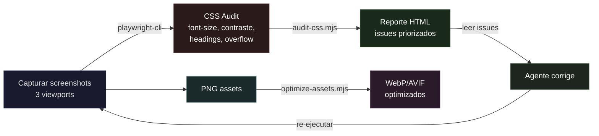

# CAPA 12 — VISUAL REVIEW [OPCIONAL]

> ⚠️ **Capa condicional.** Se activa SOLO si el proyecto necesita revisión visual automatizada (screenshots, CSS audit, visual regression, optimización de assets). Preguntar al usuario al iniciar la tarea.

Proporciona un pipeline autónomo para que el agente capture, audite, detecte errores visuales y los corrija sin intervención del usuario.

### Stack de herramientas

| Herramienta | Rol |
|---|---|
| **Playwright CLI** | Screenshots full-page en múltiples viewports + inspección DOM + console errors |
| **ImageMagick** (`magick.exe`) | Redimensionar, comparar (diff), overlay, convertir formatos |
| **Libwebp** (`cwebp.exe`) | Convertir PNG/JPEG → WebP |
| **sharp-cli** | Procesamiento rápido de imágenes (redimensionar, metadatos) |
| **pixelmatch + pngjs** | Diff pixel-level para visual regression testing |
| **@squoosh/cli** | Compresión con códecs modernos (avif, webp2) |

### Skills del ecosistema

| Skill | Installs | Rol |
|---|---|---|
| `image-edit` (agentspace-so) | 271K | Edición de imágenes con IA |
| `image-manipulation-image-magick` (github) | 9.2K | Conocimiento de ImageMagick para el agente |
| `argent-screenshot-diff` (software-mansion) | 2K | Screenshot diffing para regression |

### Scripts del módulo visual-review

- **`visual-review-pipeline.mjs`** — Pipeline completo: captura screenshots (3 viewports) → corre CSS audit → genera reporte HTML con issues priorizados
- **`audit-css.mjs`** — Eval script para Playwright: chequea contrast ratio, font-size mínimo, heading hierarchy, overflow, touch targets, console errors
- **`visual-regression.mjs`** — Compara screenshots actual vs baseline con pixelmatch, reporta diferencias
- **`optimize-assets.mjs`** — Optimiza imágenes en build output (squoosh + cwebp + sharp + ImageMagick)

### Flujo Visual Review



### Modo de uso autónomo

```bash
node .agent/skills/visual-review/scripts/visual-review-pipeline.mjs \
  --url http://localhost:3000 \
  --routes /,/about,/pricing,/blog,/docs,/download
```

### Criterios de auditoría CSS

| Check | Regla | Severidad |
|---|---|---|
| Font-size mínimo | Texto < 11px | warn |
| Contraste | Opacidad < 0.3 en texto | warn |
| Heading hierarchy | Skip de nivel (h2→h4) | warn |
| Touch targets | < 44×44px | info |
| Alt text | Img sin alt o alt="" | info |
| Overflow | Elementos clip-eados | info |
| Console errors | Cualquier error JS | error |
